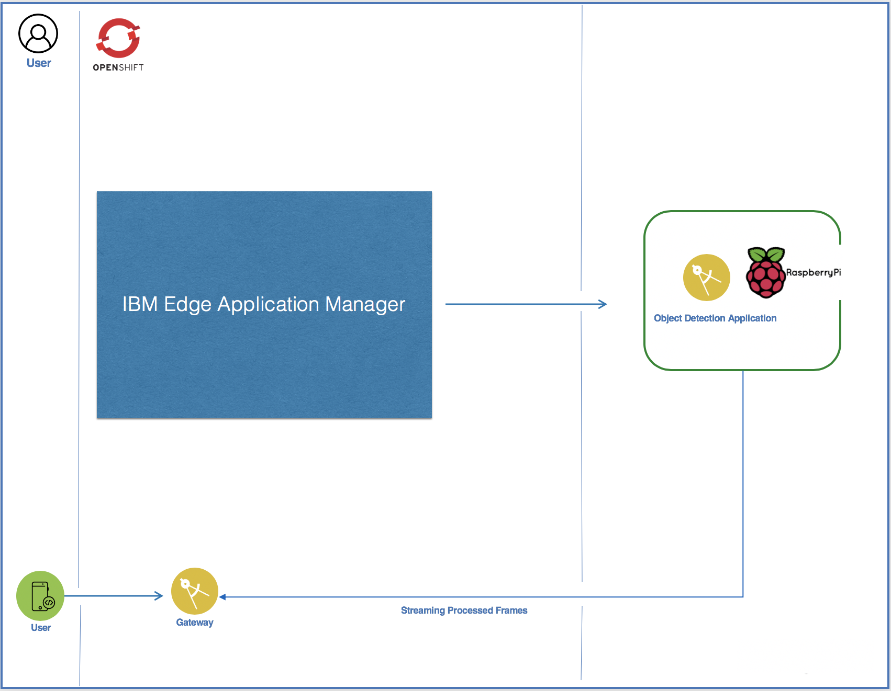

<h1 align="center">
  <br>
  <a href="https://github.com/SaifRehman/maskd.git"></a>
  <br>
      Mask Detection Demo on IBM Edge
  <br>
  <br>
</h1>

<p align="center" style="margin-top: 50px; font-weight: bold;"><b>Saif ur Rehman</b> (<a href="mailto:saif.ur.rehman@ibm.com" style="font-weight: normal">saif.ur.rehman@ibm.com</a>)</p>
<div style="page-break-after: always; break-after: page;"></div>
<br>

# Mask Detection Demo on IBM Edge

In this Repo I will walk you through on how you can build Face Mask detection demo on Raspberrypy deployed over ***IBM Edge Applocation Manager***

## High Level Architecture 



Tool used 

1. Raspberrypy as a edge hardware
2. IBM Edge Application Manager
3. Nodejs
4. Flatend
5. Openshift
6. Opencvjs
7. Cloud Annotations

Process workflow

1. Take sample images of you wearing a mask, and without masks. Take at least 200 picture with mask, 200 picture without wearing mask
2. Upload the picture to ***IBM Cloud Annotations*** and train 
3. Download the trained model and save it 
4. Deploy the edge application which takes live camera feed, and process the live camera feed through the trained model, and predict if the person is wearing mask or not. Deployment of application to raspberrypy is done by IBM Edge application manager
5. Deploy the gateway to Openshift that will listen to frames sent by raspberrypy and showcase the frames in FE

## Pre-Req

1. Have IBM Edge Application Manager installed 
2. Configure Rasbpberrypi and install RaspbianOS
3. Install Nodejs, Cloudctl, Docker in Raspberrypy
4. Have the trained model ready through Cloud Annotation 

## Training the model 

You can find an in depth walkthrough for training a TensorFlow.js model [here](https://github.com/cloud-annotations/training/).

## Deploy the gateway 

1. Login to your dockerhub

```
$ docker login
```

2. clone the repo 

```
$ https://github.com/SaifRehman/maskd.git
```
3. navigate to edge directory 

```
$ cd maskd/edge
```

4. Build the dockerfile

```
$ docker build -t edgegateway:v1
```

5. Tag the image 

```
$ docker tag edgegateway:v1 <usernname>/edgegateway:v1
```

6. Push the image

```
$ docker push  <usernname>/edgegateway:v1
```

7. Login to Openshift

8. Apply the K8 yaml to deploy the gateway

```
$ oc apply -f k8/
```

9. This will deploy the pod and create a service as loadbalancer. Please not the loadbalancer ip by this command 

```
$ oc get svc
```
